# Preguntas

## ¿Para qué usamos Clases en Python?

Una clase es una plantilla que define cómo se creará un objeto. Los objetos son instancias de una clase. Las clases son una de las características más poderosas de Python y son fundamentales para la programación orientada a objetos (POO). ¿Para qué lo usamos? Para estructurar el código de forma clara, modular y reutilizable.

Sintaxis

```Python
class LaClase:
    pass
```

En el ejemplo, la clase se llama LaClase y no tiene ninguna definición. pass significa “no hacer nada” y se usa cuando Python necesita que haya algo escrito, pero tú todavía no quieres definir nada dentro.

### Objeto

Cuando ya tenemos la clase creada, podemos utilizar para crear un objeto. Para crear un objeto, se utiliza la sintaxis nombre de LaClase().

```Python
class LaClase:
    pass

objeto = LaClase()
```

Asi crearemos un objeto de la clase LaClase y se ha almacenado en la variable objeto.

### Atributos de clase

Son variables asociadas a la clase.

```Python
class LaClase:
    atributo_de_clase = 33
```

 La clase LaClase tiene un atributo de clase llamado `atributo_de_clase` con un valor de `33`.
Para llamarlo se utiliza la sintaxis:

```Python
print(LaClase.atributo_de_clase)

```

## ¿Qué método se ejecuta automáticamente cuando se crea una instancia de una clase?

Es `__init__`un inicializador. Se ejecuta automáticamente cada vez que creas una instancia de una clase.

Como funciona:

```Python
class coche:
    def __init__(self, marca, color):
        self.marca = marca
        self.color = color

algo = coche("Renault", "Blanco")
```

En este caso, al crear `"algo"`, Python llama automáticamente a `__init__` y le pasa los argumentos Renault blanco .

`"Renault"` se asigna a `self.marca`y `"Blanco"` se asigna a `self.color`.

Hay que tener en cuenta que esto no nos devolvera nada, solo lo almacenara para luego usarlo. Para verlo tendremos que usar por ejemplo `print(algo.marca)`

## ¿Cuáles son los tres verbos de API?

Los tres verbos HTTP más fundamentales y utilizados en una API REST para gestionar recursos son `GET` (leer), `POST` (crear) y `DELETE` (eliminar). Aunque existen más, estos tres, junto con `PUT`/`PATCH` (actualizar), forman la base de las operaciones `CRUD` (Crear, Leer, Actualizar, Borrar) en la comunicación cliente-servidor.

### GET → Obtener datos

Sirve para leer información desde un servidor.

* No modifica nada
* Solo pide datos

Ejemplo sencillo:
Quieres ver una lista de usuarios:

```Python
GET /usuarios
```

### POST → Crear datos

Sirve para enviar información nueva al servidor.

* Crea un recurso nuevo
* Envías datos (por ejemplo, en un formulario)

Ejemplo:
Crear un nuevo usuario:

```Python
POST /usuarios
```

Con datos como:

```Python
nombre: "Ama"
edad: 65
```

### PUT → Actualizar datos

Sirve para modificar un recurso existente.

* Reemplaza o actualiza información
* Normalmente requiere saber qué estás editando

Ejemplo:
Actualizar el usuario con ID 1:

PUT /usuarios/1

### DELETE → Borrar datos

Sirve para eliminar un recurso en el servidor.

* Borra algo existente
* Necesita identificar qué quieres eliminar

Ejemplo:
Eliminar el usuario con ID 1:

```Python
DELETE /usuarios/1
```

## ¿Es MongoDB una base de datos SQL o NoSQL?

MongoDB es una base de datos NoSQL  (Not Only SQL), es un tipo de base de datos no relacional, os datos se guardan de forma flexible, normalmente en formato documentos en formato BSON (similar a JSON). como un conjunto de notas donde cada una puede ser distinta. No necesitas que todos los documentos tengan la misma estructura.
SQL (Structured Query Language) es un tipo de base de datos relacional, los datos se organizan en tablas con filas y columnas (como Excel).

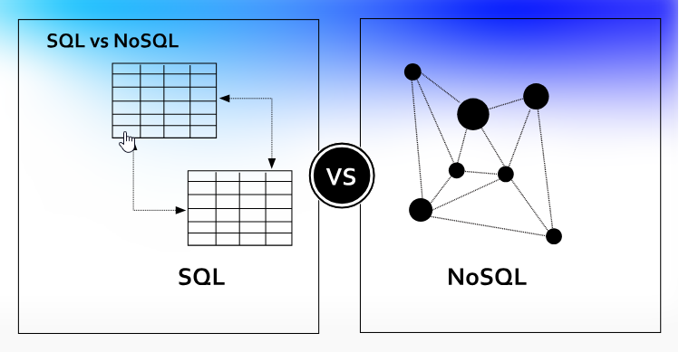

Su uso:

¿Cuándo usar NoSQL?

* Cuando los datos cambian mucho
* Aplicaciones modernas (apps móviles, redes sociales)
* Grandes volúmenes de datos
* Sistemas en tiempo real

¿Cuándo usar SQL?

* Cuando necesitas estructura fija
* Cuando hay relaciones complejas
* Sistemas financieros, bancos, ERPs

| Ejemplos NoSQL | Ejemplos SQL |
| :-------: | :--------: |
| MongoDB | MySQL |
| Firebase | PostgreSQL |
| Cassandra | SQLite |
| Redis | SQL Server |

Resumen

| SQL | NoSQL |
| :-------: | :--------: |
| Usa tablas | Usa documentos |
| Estructura rígida | Flexible |
| Ej: MySQL | Ej: MongoDB |

## ¿Qué es una API?

Una API, o interfaz de programación de aplicaciones, es un conjunto de reglas o protocolos que permite a las aplicaciones informáticas comunicarse entre sí para intercambiar datos, características y funcionalidades.

Las API simplifican y aceleran el desarrollo de aplicaciones y software permitiendo a los desarrolladores integrar datos, servicios y capacidades de otras aplicaciones, en lugar de desarrollarlas desde cero. Las API también ofrecen a los propietarios de aplicaciones una forma sencilla y segura de poner los datos y las funciones de sus aplicaciones a disposición de los departamentos de su organización. Los propietarios de aplicaciones también pueden compartir o comercializar datos y funciones con Business Partners o terceros.

Las API permiten compartir solo la información necesaria, manteniendo ocultos otros detalles internos del sistema, lo que ayuda a la seguridad del sistema. Los servidores o dispositivos no tienen que exponer completamente los datos: las API permiten compartir pequeños paquetes de datos, relevantes para la solicitud específica.

La documentación de la API es como un manual de instrucciones técnicas que proporciona detalles sobre una API e información para los desarrolladores sobre cómo trabajar con una API y sus servicios. Una documentación bien diseñada promueve una mejor experiencia de API para los usuarios y, en general, hace que las API sean más exitosas.

### ¿Cómo funcionan las API?

La arquitectura de las API suele explicarse en términos de cliente y servidor. La aplicación que envía la solicitud se llama cliente, y la que envía la respuesta se llama servidor. En el ejemplo del tiempo, la base de datos meteorológicos del instituto es el servidor y la aplicación móvil es el cliente.

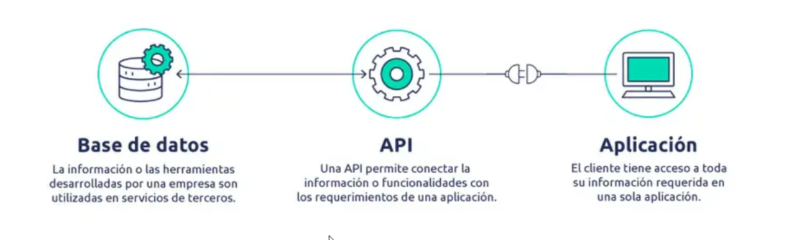

Las API pueden funcionar de cuatro maneras diferentes, según el momento y el motivo de su creación.

* API de SOAP

Estas API utilizan el protocolo simple de acceso a objetos. El cliente y el servidor intercambian mensajes mediante XML. Se trata de una API menos flexible que era más popular en el pasado.

* API de RPC

Estas API se denominan llamadas a procedimientos remotos. El cliente completa una función (o procedimiento) en el servidor, y el servidor devuelve el resultado al cliente.

* API de WebSocket

La API de WebSocket es otro desarrollo moderno de la API web que utiliza objetos JSON para transmitir datos. La API de WebSocket admite la comunicación bidireccional entre las aplicaciones cliente y el servidor. El servidor puede enviar mensajes de devolución de llamada a los clientes conectados, por lo que es más eficiente que la API de REST.

* API de REST

Estas son las API más populares y flexibles que se encuentran en la web actualmente. El cliente envía las solicitudes al servidor como datos. El servidor utiliza esta entrada del cliente para iniciar funciones internas y devuelve los datos de salida al cliente. Veamos las API de REST con más detalle a continuación.

Tambien tenemos didferentes tipos de API segun el ambito de uso

Las API se clasifican tanto en función de su arquitectura como de su ámbito de uso. Ya exploramos los principales tipos de arquitecturas de API, ahora veamos el ámbito de uso.

* API privadas

Estas son internas de una empresa y solo se utilizan para conectar sistemas y datos dentro de la empresa.

* API públicas

Están abiertas al público y pueden cualquier persona puede utilizarlas. Puede haber o no alguna autorización y coste asociado a este tipo de API.

* API de socios

Solo pueden acceder a ellas los desarrolladores externos autorizados para ayudar a las asociaciones entre empresas.

* API compuestas

Estas combinan dos o más API diferentes para abordar requisitos o comportamientos complejos del sistema.

## ¿Qué es Postman?

Postman es una herramienta utilizada para trabajar con APIs (interfaces de programación). Sirve para probar, enviar y analizar peticiones HTTP sin necesidad de escribir mucho código desde cero.

esta herramienta nos permite hacer solicitudes GET, POST, PUT, DELETE, etc. También muestra la respuesta del servidor (JSON, XML, texto…). Permite automatizar pruebas y organizar colecciones de peticiones y facilita probar endpoints de una API antes de integrarlos en una app.

Para descargarla solo tendremos que ir a [su pagina web](https://www.postman.com/) para varios S.O.

Desde Ubuntu lo podemos instalar desde la consola con:

```Bash
sudo snap install postman
```

y ejecutarlo con:

```Bash
postman
```

### Ejmplo cómo usar Postman

1. Crear una colección

Lo primero que tendremos que hacer generalmente con Postman es crear crear una colección, que nos permite agrupar solicitudes.

Abres Postman y creas una nueva colección. Las colecciones son simplemente como carpetas donde se va a guardar el histórico de todas las rutas que se componen con Postman para el acceso a un API.

Crear una nueva colección

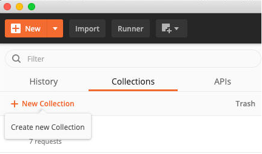

Normalmente tendrás una colección para cada proyecto en el que estés trabajando.
2. Hacer una nueva request

Una vez tienes tu colección creada, puedes incorporar en ella todas las request que necesites. Para ello, en el botón "New" escoges la opción "Request".

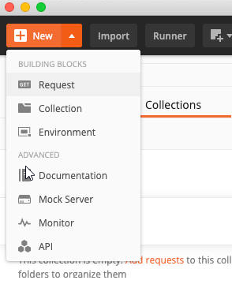

Otra opción muy rápida es pulsar en los puntos suspensivos del título de la colección y luego pulsar en "Add request", como aparece en la siguiente imagen.

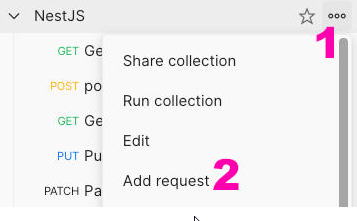

Otra alternativa para crear un request
3. Configurar el nombre de la request y la colección

Si fuiste por el botón de "New", te aparecerá un formulario que aparece, puedes dar un nombre a la request y si lo deseas una descripción. Además te permite seleccionar la colección donde vas a agregar este request.

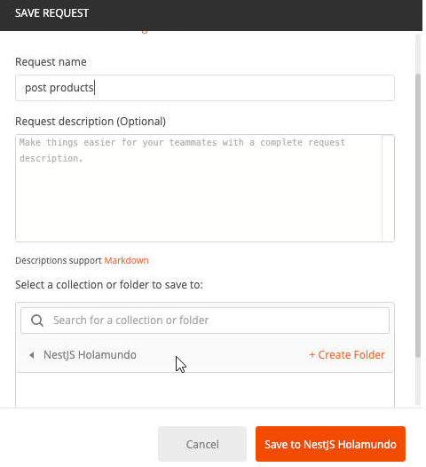

La configuración de la solicitud es bastante intuitiva, no obstante, en los siguientes puntos veremos cómo la haremos para una solicitud por el método POST.
4. Seleccionar el método del HTTP

En el panel de configuración de la nueva request que estamos creando, podemos seleccionar como método POST, en el desplegable. Puedes usar todos los métodos del HTTP posibles, aquí depende del tipo de solicitud que quieras crear para probar tu API.
5. Escribe la URL del recurso al que quieres acceder con Postman

En la barra de direcciones, parte central del panel, escribimos la URL de nuestra aplicación, hacia la ruta que estamos creando.

Lógicamente, aquí pondrás la URL de aquella API que estés desarrollando, o que estés usando vía Postman. Puede ser algo como http://localhost:3000/products.

Generalmente una solicitud POST contra un recurso de API REST se hace contra la raíz del recurso, en este caso products. El hecho de enviar la solicitud por el método POST ya indica en el funcionamiento normal de las API REST que lo que necesitas es hacer una solicitud de inserción de un ítem de ese recurso. Al desarrollar una API, esta URL estará relacionada generalmente con un método de un controlador.
6. Envía la solicitud

Por último puedes apretar el botón "Send" que aparece destacado en azul. La request se procesará y mostrará el resultado en la parte inferior del panel.

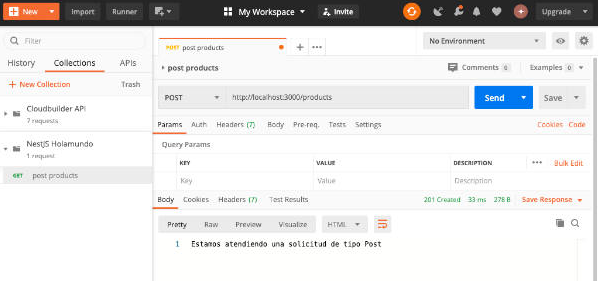
7. Salva la request cuando lo necesites

También puedes grabar la request, con el botón de "Save". Esto permitirá que Postman almacene el estado de esta solicitud, para que puedas volver a ella las veces que haga falta, realizando la request de nuevo para poder ejercitar una vez más ese endpoint.

### Ejemplo cómo enviar datos en el body con Postman

Ahora os damos las guías para poder mandar los datos necesarios en el body de la solicitud, de manera que los podamos recibir en NestJS.

1. Configuramos el "Body" de la solicitud que tenemos abierta

En el panel de la request dentro de Postman, seleccionamos la pestaña "Body"
2. Indicar el formato del body como "raw" y "JSON"

En el desplegable del tipo de información que estamos enviando vamos a escoger "raw", para componer datos en crudo por nosotros mismos. En la sintaxis, el desplegable del lado, seleccionamos "JSON".
3. Escribimos el JSON que se desea enviar

Luego componemos nuestro objeto JSON a mano, que tiene que estar correctamente formado.

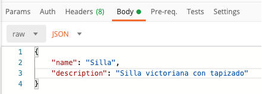

Ten en cuenta que son necesarias las comillas dobles en el nombre de cada propiedad del objeto JSON. Si son cadenas los valores, también tienes que colocar comillas dobles. Puedes encontrar más información del Formato JSON. https://desarrolloweb.com/home/json
4. Enviamos la solicitud con el botón Send

Una vez compuesto el body con los datos que queremos / necesitamos, vamos de nuevo a enviar la solicitud con el botón "Send".

## ¿Qué es el polimorfismo?

El polimorfismo es la capacidad de algo de presentar múltiples formas o comportamientos, concepto aplicado principalmente en biología y programación. Significa "muchas formas", permitiendo que elementos con una misma interfaz (como métodos de programación o genes) actúen o se expresen de manera distinta

Es un modelo de datos flexible, lo que significa que los documentos de una sola colección no necesitan tener la misma estructura. Los datos polimórficos son datos en una sola colección que varían en los campos de los documentos o en los tipos de datos.

Generalmente, los documentos de una colección son similares en estructura, pero pueden contener ligeras variaciones según la aplicación. Para agrupar documentos similares, pero no idénticos, en una sola colección, puedes utilizar los patrones de diseño de esquemas Polimórfico y Herencia.

Estos diseños de esquemas pueden mejorar el rendimiento al almacenar datos en función de los patrones de acceso a queries, en lugar de simplemente en función de la forma del documento.

```Python
class Bilbao:
    def descripcion(self):
        return "Bilbao: Bilbo."

class SanSebastian:
    def descripcion(self):
        return "San Sebastián: Donosti."

class Vitoria:
    def descripcion(self):
        return "Vitoria: Gasteiz."

def mostrar_info(ciudad):
    print(ciudad.descripcion())

ciudades = [Bilbao(), SanSebastian(), Vitoria()]

for ciudad in ciudades:
    mostrar_info(ciudad)
```

El polimorfismo actua en la funcion:

```Python
def mostrar_info(ciudad):
    print(ciudad.descripcion())
```

No importa si es Bilbao, San Sebastián o Vitoria el polimorfismo aquí permite tratar todas las ciudades de la misma forma (mostrar_info),

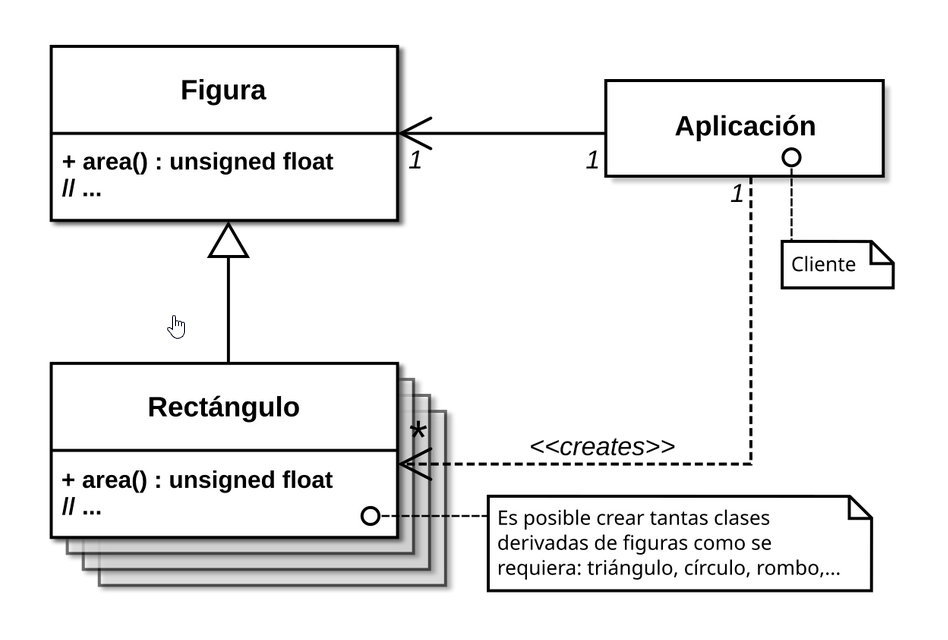

## ¿Qué es un método dunder?

El metodo Dunder (abreviatura de “double underscore”) son aquellos cuyo nombre comienza y termina con dos guiones bajos (__).

Estos métodos no se llaman directamente, sino que son invocados automáticamente por el intérprete de Python en diversas situaciones (como operaciones aritméticas, manipulación de secuencias y gestión del contexto).

También conocidos como métodos mágicos o especiales

Algunos de los métodos dunder más comunes son:

| Método | Descripción |
| ------- | :--------: |
| `__init__` | Inicializa una nueva instancia de una clase |
| `__str__` | Devuelve una string de un objeto, amigable para el usuario |
| `__repr__` | Devuelve una string de un objeto, amigable para el desarrollador |
| `__len__` | Devuelve la longitud de un objeto |
| `__getitem__` | Permite acceder a elementos mediante índices |
| `__setitem__` | Permite asignar valores a elementos mediante índices |
| `__delitem__` | Permite eliminar elementos mediante índices |
| `__iter__` | Devuelve un iterador para el objeto |
| `__next__` | Devuelve el siguiente elemento del iterador |

1. Inicialización y construcción

Los métodos Dunder como `__new__`, `__init__` y `__del__` controlan cómo se crean, inicializan y, finalmente, destruyen los objetos.

 `__new__`vs. `__init__`: `__new__` se encarga de crear una nueva instancia, mientras que `__init__` la inicializa. Esta separación es importante cuando trabajas con tipos inmutables, en los que podrías sustituir `__new__` por otra cosa.

 `__del__`: Este método actúa como destructor, permitiendo la limpieza cuando un objeto está a punto de ser recogido como basura.

Incluso puedes personalizar `__new__` en clases inmutables para aplicar reglas de creación específicas.
2. Métodos numéricos y aritméticos

Los métodos Dunder como `__add__`, `__sub__`, `__mul__`, y sus variantes in-place permiten que tus objetos admitan operaciones aritméticas. Esto se conoce como sobrecarga de operadores. Al definir estos métodos, puedes habilitar un comportamiento aritmético natural para tus objetos personalizados.

Por ejemplo, sobrecarga `__add__` en una clase Vector para sumar los elementos correspondientes de dos vectores. Esto es especialmente útil cuando se diseñan clases que modelan conceptos matemáticos o instrumentos financieros.
3. Métodos de comparación e igualdad

Métodos como `__eq__`, `__lt__`, y `__gt__` determinan cómo se comparan los objetos. Estos métodos te permiten definir qué significa que dos objetos sean iguales o cómo deben ordenarse.

Un ejemplo típico es comparar las áreas de dos formas: puedes modificar `__lt__` para que devuelva true si el área de una forma es menor que la de la otra. Esto puede ser útil en colecciones o algoritmos de ordenación.
4. Métodos de representación de cadenas

 Los métodos `__str__` y `__repr__` controlan cómo se muestran tus objetos como cadenas.

 `__repr__` debe proporcionar una representación amigable para el desarrollador que pueda utilizarse para recrear el objeto.

 `__str__` se centra en una pantalla fácil de usar.
5. Métodos contenedor e iterable

Para que tus objetos se comporten como secuencias o contenedores, puedes implementar métodos como `__len__`, `__getitem__`, y `__iter__` . Esto permite operaciones como la indexación, la iteración y las pruebas de pertenencia.

Por ejemplo, si diseñas una pila o lista personalizada, implementar estos métodos te permite utilizar funciones incorporadas como `len()`.
6. Llamabilidad y programación funcional

Con el método `__call__`, las instancias de tu clase pueden invocarse como si fueran funciones. Esto es especialmente útil para crear objetos de función con estado que puedan almacenar en caché los resultados o mantener el estado interno a través de las llamadas. Piensa en ello como si convirtieras tu objeto en un mini-motor de cálculo al que puedes llamar repetidamente con diferentes parámetros.
7. Responsables de contexto

Implementar los métodos `__enter__` y `__exit__` permite utilizar tus objetos con la declaración para la gestión de recursos. Esto es crucial para gestionar recursos como manejadores de archivos o conexiones de red, asegurándote de que se configuran y limpian correctamente.

Un escenario del mundo real es utilizar un gestor de contexto personalizado para abrir y cerrar conexiones a bases de datos de forma segura.
8. Acceso a atributos y descriptores

Métodos como `__getattr__`,`__setattr__`  y `__delattr__` te permiten controlar cómo se accede a los atributos y cómo se modifican. El protocolo descriptor perfecciona esto al permitir que los objetos gestionen el acceso a los atributos de forma dinámica.

Por ejemplo, un descriptor podría validar o transformar valores de atributos, asegurándose de que cumplen criterios específicos antes de ser establecidos.

## ¿Qué es un decorador de python?

Los decoradores son funciones que modifican el comportamiento de otras funciones y ayudan a acortar nuestro código. Si alguna vez has visto @, estás ante un decorador o decorator, bien sea uno que Python ofrece por defecto o uno que puede haber sido creado ex profeso.

Si aún no controlas las funciones te recomendamos que empieces con este post.

Veamos un ejemplo muy sencillo. Tenemos una función suma() que vamos a decorar usando decorador(). Para ello, antes de la declaración de la función suma, hacemos uso de @decorador

```Python
def decorador(funcion):
    def nueva_funcion(a, b):
        print("Se va a llamar")
        c = funcion(a, b)
        print("Se ha llamado")
        return c
    return nueva_funcion

@decorador
def suma(a, b):
    print("Entra en funcion suma")
    return a + b

suma(5,8)
```

Lo que realiza decorador() es definir una nueva función que encapsula o envuelve la función que se pasa como entrada. Concretamente lo que hace es hace uso de dos print(), uno antes y otro después de la llamada la función.

Por lo tanto, cualquier función que use @decorador tendrá dos print, uno y al principio y otro al final, dando igual lo que realmente haga la función.

### Decoradores con parámetros

Tal vez quieras que tu decorador tenga algún parámetro de entrada para modificar su comportamiento. Se puede hacer envolviendo una vez más la función como se muestra a continuación.

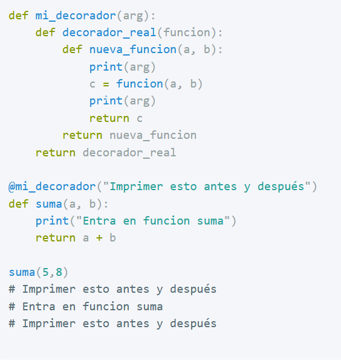

### logger

Una de las utilidades más usadas de los decoradores son los logger. Su uso nos permite escribir en un fichero los resultados de ciertas operaciones, que funciones han sido llamadas, o cualquier información que en un futuro resulte útil para ver que ha pasado.

En el siguiente ejemplo tenemos un uso más completo del decorador log() que escribe en un fichero los resultados de las funciones que han sido llamadas.

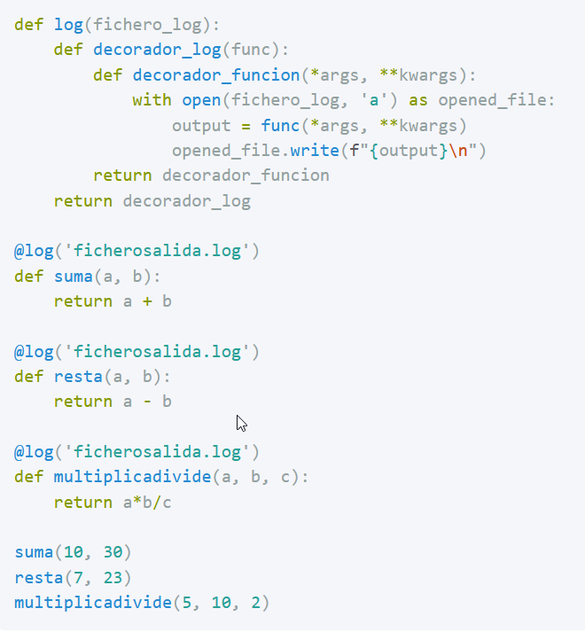

el decorador puede ser usado sobre funciones que tienen diferente número de parámetros de entrada, y su funcionalidad será siempre la misma. Escribir en el fichero pasado como parámetro los resultados de las operaciones.

### Uso autorizado

Otro caso de uso  y ampliamente usado en Flask, que es un framework de desarrollo web, es el uso de decoradores para asegurarse de que una función es llamada cuando el usuario se ha autenticado.

Realizando alguna simplificación, podríamos tener un decorador que requiriera que una variable autenticado fuera True. La función se ejecutará solo si dicha variable global es verdadera, y se dará un error de lo contrario.

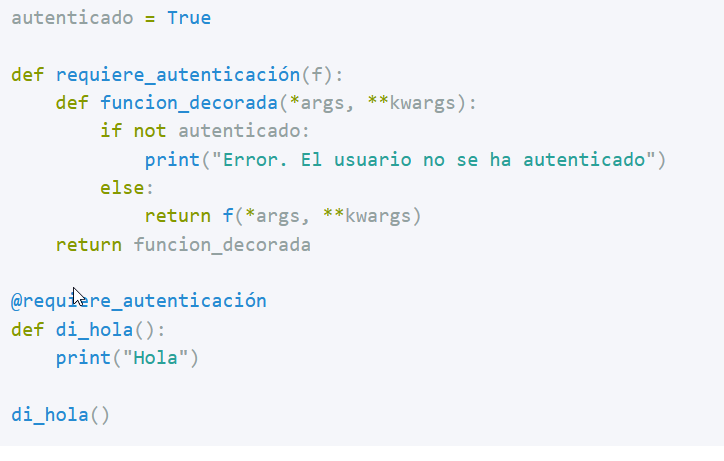
